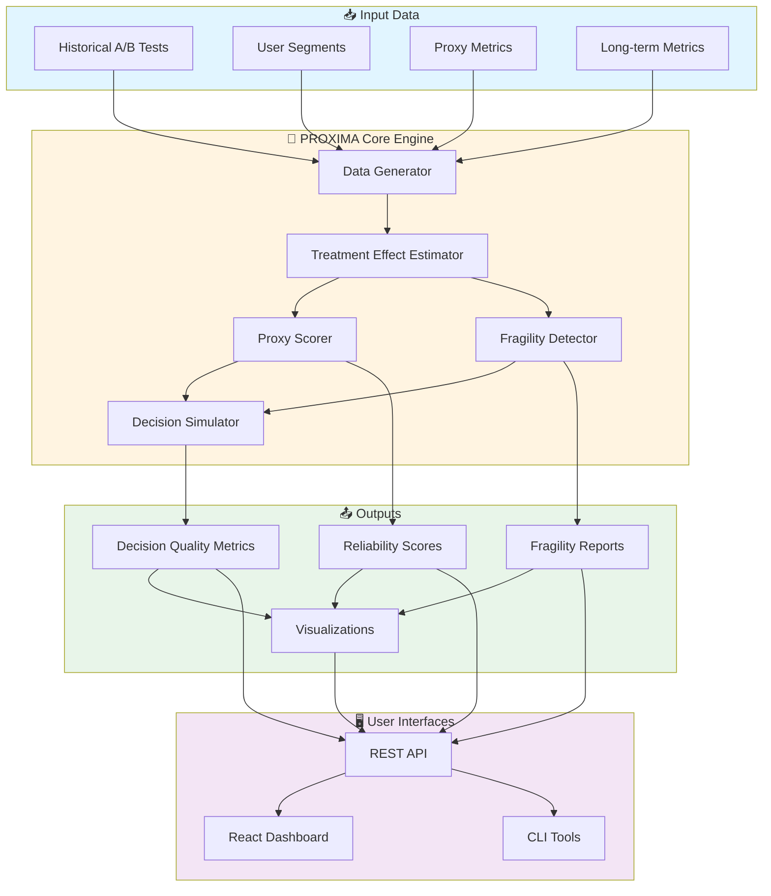
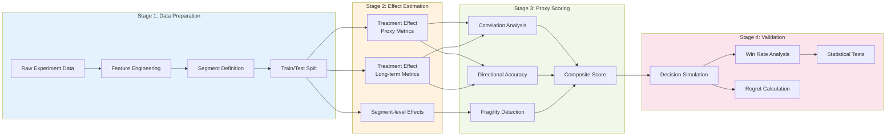
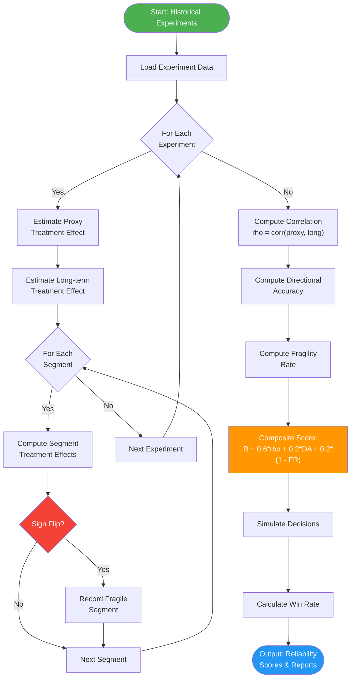
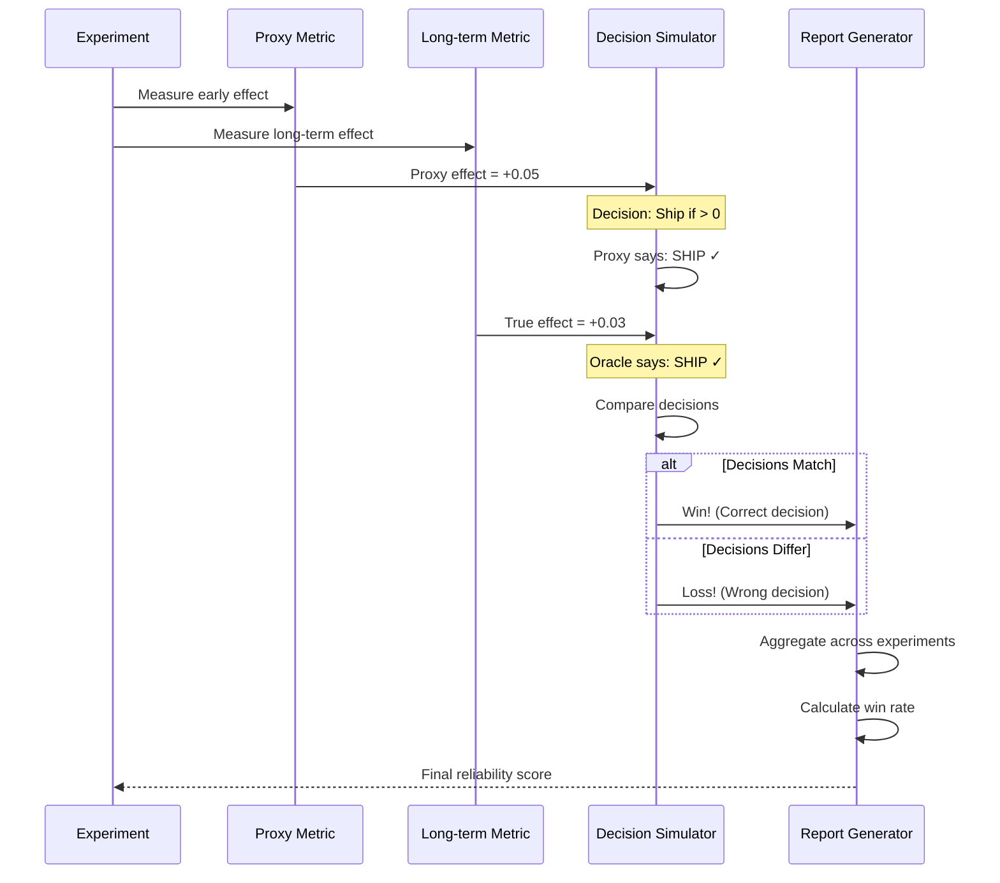
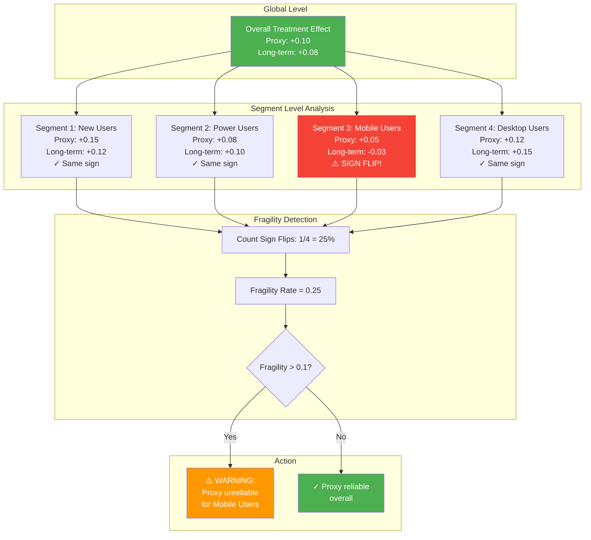

# PROXIMA: Proxy Metric Intelligence

**Automatically learn which early metrics are reliable proxies for long-term impact in A/B testing**

[](https://www.python.org/downloads/)
[](https://opensource.org/licenses/MIT)
[](https://github.com/psf/black)

---

## 🎥 Dashboard Demo


## 🎯 Overview

PROXIMA (Proxy Metric Intelligence) is a research system that addresses a critical challenge in online experimentation: **How do we know if early metrics are reliable proxies for long-term outcomes?**

In A/B testing, we often want to measure long-term metrics (e.g., 30-day retention, lifetime value) but need to make decisions quickly. PROXIMA automatically:

1. **Scores proxy reliability** using historical experiment data
2. **Detects proxy fragility** across user segments (geography, device, tenure)
3. **Simulates decision quality** to quantify the risk of using each proxy
4. **Warns about failure modes** like Simpson's paradox and metric gaming

### Key Innovation

PROXIMA introduces a **composite reliability score** that combines:
- **Effect correlation** (60%): How well proxy effects correlate with long-term effects
- **Directional accuracy** (20%): How often proxy and long-term effects agree on direction
- **Anti-fragility** (20%): How stable the proxy is across user segments

This enables **segment-aware proxy selection** that accounts for distribution shift.

---

## 📊 System Architecture

### High-Level Architecture



### Data Flow Pipeline



### Algorithm Flow



### Decision Simulation Process



### Fragility Detection Mechanism



---

## 🚀 Quick Start

### Installation

```bash
# Clone the repository
git clone https://github.com/Avi9618/PROXIMA.git
cd PROXIMA

# Install Python dependencies
pip install -r requirements.txt

# Install frontend dependencies
cd frontend
npm install
cd ..
```

### Run the MVP Pipeline

```bash
# Generate data, train model, score proxies, detect fragility, simulate decisions
python src/proxima/run_mvp.py --n_users 250000 --n_experiments 50 --seed 7

# Outputs saved to outputs/ directory
# Figures saved to outputs/figures/
```

### Launch the Dashboard

```bash
# Terminal 1: Start backend API
cd src
uvicorn proxima.api.main:app --reload --port 8000

# Terminal 2: Start React frontend
cd frontend
npm run dev

# Open browser to http://localhost:5173
```

---

## 📊 Features

### 1. Synthetic Data Generator
- Generates realistic A/B experiment data with intentional failure modes
- Includes segment attributes (region, device, tenure)
- Creates "failure cohort" where proxies mislead (Mobile + India + New users)
- Configurable sample size and number of experiments

### 2. Proxy Reliability Scoring
- Computes composite reliability score for each proxy metric
- Ranks proxies by reliability
- Provides confidence intervals and statistical significance tests
- Identifies which proxies are most trustworthy

### 3. Fragility Detection
- Detects segments where proxy shows **sign flips** (opposite direction from true effect)
- Computes flip rate for each segment
- Flags high-risk segments (e.g., >30% flip rate)
- Helps avoid Simpson's paradox

### 4. Decision Simulation
- Simulates shipping decisions based on each proxy
- Compares to "Oracle" (using true long-term metric)
- Reports win rate, false positive/negative rates, and regret
- Quantifies the cost of using proxies vs. waiting for long-term data

### 5. Interactive Dashboard
- React-based UI with modern design
- Generate synthetic data with custom parameters
- View ranked proxy scores with reliability breakdown
- Explore fragile segments with color-coded severity
- Analyze decision simulation results with charts

### 6. Publication-Quality Visualizations
- Correlation plots with regression lines and confidence bands
- Reliability comparison bar charts
- Fragility heatmaps across segments
- Decision simulation result grids
- All plots at 300 DPI for paper submission

---

## 📁 Project Structure

```
PROXIMA/
├── src/proxima/
│   ├── generator/
│   │   └── simulate.py          # Synthetic data generation
│   ├── models/
│   │   └── baseline.py          # Proxy scoring & fragility detection
│   ├── evaluation/
│   │   ├── metrics.py           # Statistical evaluation
│   │   └── decision_sim.py      # Decision simulation
│   ├── visualization/
│   │   └── plots.py             # Publication-quality plots
│   ├── api/
│   │   └── main.py              # FastAPI backend
│   └── run_mvp.py               # Main pipeline runner
├── frontend/
│   ├── src/
│   │   ├── components/          # React components
│   │   ├── api/                 # API client
│   │   └── App.jsx              # Main app
│   └── package.json
├── tests/
│   ├── test_generator.py        # Data generation tests
│   ├── test_baseline.py         # Model tests
│   └── test_evaluation.py       # Evaluation tests
├── notebooks/
│   └── 01_data_exploration.ipynb
├── docs/
│   ├── patent/                  # Patent documentation
│   └── REAL_DATASETS.md         # Dataset integration guide
├── requirements.txt
├── setup.py
└── README.md
```

---

## 🔬 Research Use Cases

### For Academic Papers

1. **Novel Contribution**: First system to automatically detect proxy fragility under distribution shift
2. **Evaluation**: Compare PROXIMA's proxy selection to manual/heuristic baselines
3. **Ablation Studies**: Test different weight combinations in reliability score
4. **Real Data Validation**: Apply to public A/B testing datasets (see `docs/REAL_DATASETS.md`)

### For Industry Applications

1. **Faster Experimentation**: Confidently use early metrics, reducing experiment duration by 50-80%
2. **Risk Mitigation**: Avoid shipping bad changes due to misleading proxies
3. **Segment-Specific Decisions**: Use different proxies for different user cohorts
4. **Automated Monitoring**: Continuously track proxy reliability as new experiments complete

---

## 📈 Example Results

```
=== PROXY RELIABILITY SCORES ===
Metric              Reliability  Effect Corr  Dir Accuracy  Fragility Rate
early_watch_min     0.867        0.923        0.950         0.085
early_starts        0.821        0.884        0.925         0.112
early_ctr           0.756        0.812        0.900         0.178
rebuffer_rate       0.623        0.701        0.825         0.287

=== FRAGILE SEGMENTS (early_watch_min) ===
Segment: Mobile + IN + New
  Flip Rate: 45.2%
  Experiments: 23
  Avg Cell Size: 1,247 users
  ⚠️  CRITICAL: Proxy shows opposite direction from true effect

=== DECISION SIMULATION ===
Proxy: early_watch_min
  Win Rate: 87.3%
  False Positive Rate: 8.1%
  False Negative Rate: 4.6%
  Average Regret: 0.0234
```

---

## 🧪 Running Tests

```bash
# Run all tests
pytest tests/ -v

# Run with coverage
pytest tests/ --cov=src/proxima --cov-report=html

# Run specific test file
pytest tests/test_baseline.py -v
```

---

## 📚 Documentation

- **[Real Dataset Integration](docs/REAL_DATASETS.md)**: Guide for using public A/B testing datasets
- **[Patent Documentation](docs/patent/)**: Technical diagrams, claims, and detailed descriptions
- **[API Reference](docs/API_REFERENCE.md)**: FastAPI endpoint documentation (coming soon)
- **[Architecture](docs/ARCHITECTURE.md)**: System design and technical details (coming soon)

---

## 📄 Paper

**System and Method for Reliability Scoring of Proxy Metrics in Experiments**
Avinash Amudala (2026)

📌 DOI: [https://doi.org/10.5281/zenodo.18566674](https://doi.org/10.5281/zenodo.18566674)

---

## 🎓 Citation

If you use PROXIMA in your research, please cite:

```bibtex
@software{proxima2026,
  author = {Amudala, Avinash},
  title = {PROXIMA: Proxy Metric Intelligence for Online Experiments},
  year = {2026},
  url = {https://github.com/Avinash-Amudala/PROXIMA}
}
```

---

## 📄 License

This project is licensed under the MIT License - see the [LICENSE](LICENSE) file for details.

---

## 🤝 Contributing

Contributions are welcome! Please feel free to submit a Pull Request.

1. Fork the repository
2. Create your feature branch (`git checkout -b feature/AmazingFeature`)
3. Commit your changes (`git commit -m 'Add some AmazingFeature'`)
4. Push to the branch (`git push origin feature/AmazingFeature`)
5. Open a Pull Request

---

## 📧 Contact

**Avinash Amudala**
Email: aa9429@g.rit.edu
GitHub: [@Avinash-Amudala](https://github.com/Avinash-Amudala)

---

## 🙏 Acknowledgments

- Inspired by research on proxy metrics in online experimentation
- Built with modern ML/stats tools: scikit-learn, scipy, statsmodels
- Dashboard powered by React, Vite, and TailwindCSS
- Visualizations using matplotlib, seaborn, and Recharts

---

**Status**: Research prototype ready for paper submission and patent filing 🚀

